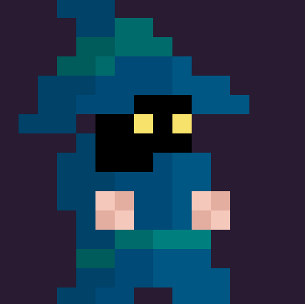

# retro_roguelike_game

Here's the source code of the retro_roguelike_game made with babylonJS!

# Synopsis

Vous êtes un magicien en quête de pouvoir dans un donjon maudit. Augmenter votre force en récupérant les power-up laissez par les monstres afin d'occire le dragon.

Prenez garde ! Le donjon change de configuration à chaque nouvel essai le rendant **unique**.

Une fois Niveau 4 atteint, vous débloquerez le mode infini+ ainsi le personnage de la magicienne.

# L'équipe

Paul Laudien
Nicolas Lanoux
Joel Galigne

# Commandes Clavier

Commande | Action
--------- | ----------
zqsd | déplacement
flèches directionnelles | tir directionnel

# Commandes Manette

joystick gauche | déplacement
joystick droit | tir directionnel

# Le Jeu

Le jeu est disponible sur ce lien : https://dakharr.itch.io/retro-roguelike-game?secret=AQEH39Llzkp8myGTPrrs4OS3A

Pour lancer le jeu en local il faut installer npm et node.js puis executer le script Windows_NPM_INSTALL.bat pour installer les dépendances et Windows_START.bat pour lancer le serveur. Enfin sur votre navigateur cherchez localhost.

# La vidéo

Une vidéo de présentation du jeu est disponible ...

## Détails techniques

Voici quelques détails sur les techniques que nous avons mises en place dans le jeu.

### Style 2D

Pour obtenir cet effet 2D dans le moteur 3D de Babylonjs nous avons utiliser une caméra orthographique. En plus, nous avons utilisé des matériaux qui n'utilisent pas de lumière et avec une couleur émissive blanche pour ne pas avoir une scène sombre.

### Editeur de niveau

Nous avons réutilisé notre éditeur de niveau du dernier concours Game on Web 2020. Nous l'avons un peu amélioré pour qu'il supporte deux couches d'objet différent. Une première avec uniquement les textures de la salle et un second pour les éléments interactifs comme des portes, des trous, des murs ou des monstres.

### Génération de niveau

Nous avons pour ce jeu utilisé la génération procédurale pour créer les différents donjons. Notre système consiste à assembler plusieurs salles préfabriquées différentes dans un ordre pseudo-aléatoire cohérent pour créer le niveau. Par exemple, le générateur prend en compte la position des portes si on entre dans une porte à droite de la map la prochaine salle aura une porte à gauche et le joueur apparaîtra sur cette porte.

### Optimisation de l'affichage

Comme pour le précédent jeu, nous avons optimisé l'affichage des niveaux avec l'instanciation des différents blocks afin de réduire les drawcalls et potentiellement jouer au jeu sur des plateformes mobiles.

## Remerciements

Nous tenons à remercier les organisateurs de Games on Web 2022 pour avoir organisé ce concours, Michel Buffa et Sebastien Vandenberghe pour leurs aides et leurs conseils.

Nous tenons à remercier tout particulièrement Nathan Miniere qui a composé les musiques du jeu.

## Liens utiles

https://www.babylonjs.com

https://www.cgi.fr/fr-fr/event/games-on-web-2022

https://www.nathanminiere.com
